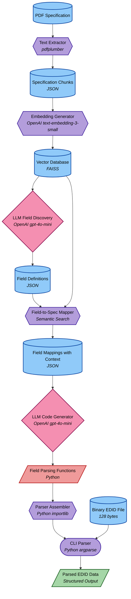

# EDID Forge Mini: AI-Driven Spec-to-Parser Pipeline

A Python-based pipeline that takes the EDID hardware specification in PDF form and generates deterministic parsing code for EDID binary files.

## 🔧 Overview

This system:

  - Parses the EDID PDF specification
  - Maps byte offsets/fields to relevant descriptions
  - Uses those mappings to generate reliable parsing code
  - Outputs a working CLI parser for EDID binary files

This is a minimal working prototype of a full spec-to-GUI toolchain, demonstrating how AI-driven code generation can transform a complex specification document into working code.

## 📊 Pipeline Architecture



### Node Shapes Legend

- **Cylinder [(name)]**: Data storage components (PDF, binary files, JSON data)
- **Hexagon {{name}}**: Processing components that transform data
- **Diamond {name}**: Decision or AI components that make intelligent choices
- **Rounded Rectangle [/name/]**: Generated output components
- **Stadium ([name])**: User interface or command-line components

### 🔄 Modifiable vs. Generated Components

The pipeline consists of two types of components:

#### Modifiable Components (Purple)

These components can be modified by developers to improve the pipeline:

  - **Text Extractor**: The PDF extraction script (`extract_pdf.py`)
  - **Embedding Generator**: The embedding generation script (`embed_store.py`)
  - **Field-to-Spec Mapper**: The field mapping script (`map_fields.py`)
  - **Parser Assembler**: The parser assembly script (`parse_edid.py`)
  - **CLI Parser**: The run pipeline script (`run_pipeline.py`)

#### Generated Components (Red)

These components should NOT be manually modified as they are generated by the pipeline:

  - **Field Parsing Functions**: The individual parsing functions in the `functions/` directory

#### Intermediate Data (Orange)

These data artifacts are generated during pipeline execution:

  - **Specification Chunks**: Extracted text chunks from the PDF
  - **Vector Database**: FAISS index of embedded chunks
  - **Field Definitions**: AI-discovered fields from the specification
  - **Field Mappings**: Mappings between fields and specification chunks

The pipeline is designed to regenerate all intermediate data and generated components from scratch when run with the `--clean` flag.

## 🧩 Pipeline Steps in Detail

The pipeline consists of the following key components:

1. **Data Extraction**: PDF specification processed using `pdfplumber` to extract meaningful text chunks

2. **Semantic Indexing**: Chunks embedded using OpenAI's `text-embedding-3-small` and stored in a `FAISS` vector database

3. **Field Discovery**: OpenAI's `gpt-4o-mini` analyzes the specification to identify relevant fields

4. **Context Mapping**: Fields mapped to specification context using semantic search via the FAISS index

5. **Code Generation**: OpenAI's `gpt-4o-mini` generates parsing code for each field based on specification context

6. **Parser Assembly**: Individual parsing functions dynamically imported and assembled into a CLI tool using Python's `importlib` and `argparse`

## 📋 Project Structure

```
edidforge-mini/
├── data/
│   ├── raw/              # Raw data (spec chunks, binary files)
│   ├── processed/        # Processed data (embeddings, field mappings)
│   └── output/           # Output data (parsed EDID)
├── example/              # Example EDID binary files
├── functions/            # Generated parsing functions
├── scripts/              # Pipeline scripts
│   ├── extract_pdf.py    # PDF extraction
│   ├── extract_hex_to_bin.py # Convert hex to binary
│   ├── embed_store.py    # Generate embeddings and store in FAISS
│   ├── discover_fields.py # Discover fields from specification
│   ├── map_fields.py     # Map fields to specification chunks
│   ├── generate_code.py  # Generate parsing code
│   └── parse_edid.py     # Parse EDID binary data
├── spec/                 # EDID specification PDFs
├── run_pipeline.py       # Main pipeline orchestration script
└── README.md             # This file
```

## 🚀 Getting Started

### Prerequisites

- Python 3.8+
- Virtual environment (recommended)
- OpenAI API key (for embeddings and code generation)

### Installation

1. Clone the repository:
   ```bash
   git clone https://github.com/yourusername/edidforge-mini.git
   cd edidforge-mini
   ```

2. Create and activate a virtual environment:
   ```bash
   python -m venv .venv
   .venv\Scripts\activate  # Windows
   source .venv/bin/activate  # Linux/Mac
   ```

3. Install dependencies:
   ```bash
   pip install -r requirements.txt
   ```

4. Create a `.env` file with your OpenAI API key:
   ```
   OPENAI_API_KEY=your_api_key_here
   ```

### Running the Pipeline

Run the complete pipeline with:

```bash
python run_pipeline.py
```

To clean all generated artifacts before running:

```bash
python run_pipeline.py --clean
```

### Output

After running the pipeline, you'll find:
- Extracted specification chunks in `data/raw/spec_chunks.json`
- Generated field definitions in `data/processed/field_definitions.json`
- Field mappings with context in `data/processed/field_mapping.json`
- Generated parsing functions in the `functions/` directory
- Parsed EDID data in `data/output/parsed_edid.json`

## 🔒 Constraints

- No runtime LLM inference — all AI output is build-time only
- Parser is fully deterministic and inspectable
- Output is source-traceable (links each field to spec chunks)

## 📝 License

This project is licensed under the MIT License - see the LICENSE file for details.
